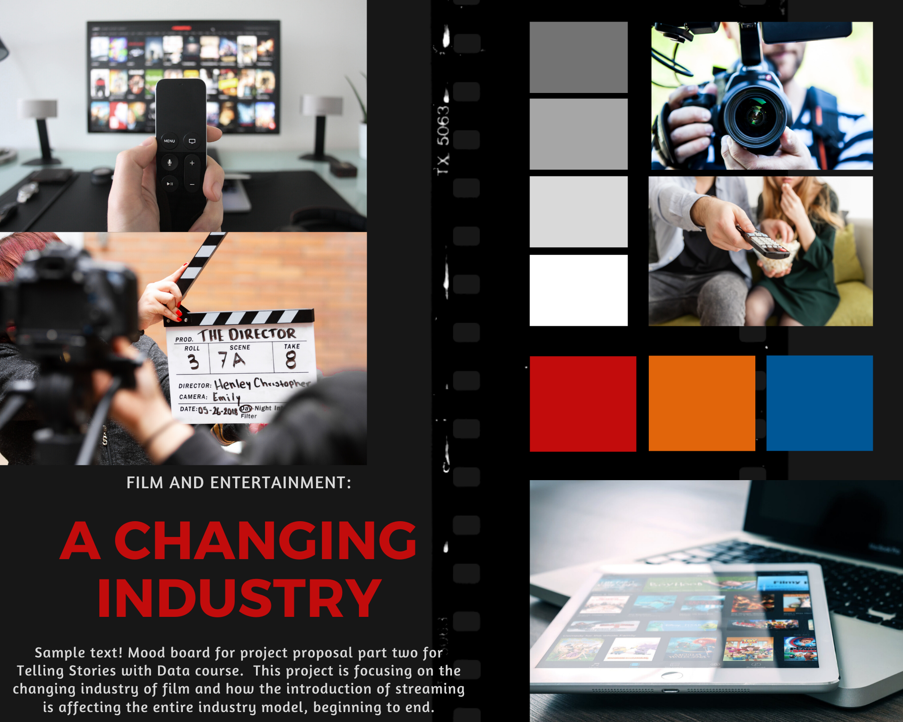

# Project Proposal I
This project is focusing on television and movies in the entertainment industry over the past several years, and how streaming platforms like Netflix are disrupting that established industry.  The new distribution platform is shifting viewers away from traditional television and movie theaters and towards streaming content on personal devices.

### Project Outline:
**1. But movie production is steady?**  
I plan to start by briefly looking at movie production over the past several years. This would show that movie production has been increasing fairly consistently. It's easy to think based off of this and similar graphs and statistics that the big production companies are continuing to do well and that the entertainment industry is stable.  
.png)  
**2. Movie Theater ticket sales are decreasing.**  
This section will look more closely at how consumers are actually viewing those new movies. Ticket sales for movie theaters in the US have been significantly decreasing over time while the price of a ticket has been significantly increasing. This should be a red flag for traditional production companies because their movies are reaching much fewer people than they were before. Prior to streaming services, you had to go to the movie theater to see new content. Now, with platforms like Netflix creating original content that is just shown on their streaming services, new content is viewable more easily. Content is also bundled together so there are many more options.  
.png)  
**3. Younger generations are not watching traditional television.**  
This section will focus on the fact that younger generations are not watching television and are instead switching to streaming shows. As production companies that make money off of television advertisements based on number of viewers, this is also a huge red flag because the number of viewers is steadily decreasing.  
.png)  
**4. There is a steady increase in Netflix subscribers.**  
This is in conjunction with the last points about fewer and fewer people watching traditional television and going out to movie theaters. Netflix and other streaming services have created a new distribution platform for almost all media types. Not only is this platform less expensive than traditional cable, it is easier on viewers as well. There are more options because shows are bundled, shows can be watched on the customer's timetable, and the use of "big data" allows streaming services to anticipate what a customer will enjoy watching because of previous behaviors. The changes to the distribution channels have opened up many more areas of change in the industry. Production companies need to re-evaluate their old business models because the entire industry is currently going through a foundational change.  
.png)  
**5. Call to action:** Big production companies should be thinking about changing their business model because the internet is changing the way customers want to view content.

   *I originally created these graphs separately and realized in putting this all together how many line graphs there are. I plan on working through how to better represent some of these graphs in part two of the project proposal with the help of feedback from others.*

### Data Sources
My first data source is located [here](https://www.kaggle.com/danielgrijalvas/movies/version/2). It is a dataset containing 6820 movies (220 movies per year, 1986-2016) scraped from IMDb and contains information about each movie’s budget, production company, country of origin, director, genre, gross revenue, IMDb rating, and release date. This data will be used primarily for the first plot regarding movie production over time.

My second dataset is located [here](https://www.kaggle.com/clouds0715/thefilmindustry#the%20film%20industry_US_08-17_English.csv). This data was pulled from [The Numbers](https://www.the-numbers.com/market/), a data and movie website, and contains data on number of screens, average ticket price, total gross, the number of sold tickets and the number of movies released in United States. This dataset will provide the data for the visualization on movie ticket sales.

My third dataset is located [here](https://www.statista.com/statistics/786371/time-spent-traditional-tv-age/). The data comes from a survey done by Nielsen Holdings Plc and was originally published by [MarketingCharts](https://www.marketingcharts.com/featured-105414).  Nielsen Holdings Plc is an American information, data and measurement firm that provides research, ratings, and data for different media types. This data will be used to show that it's primarily older generations that watch traditional television.

My fourth dataset is located [here](https://www.statista.com/statistics/250937/quarterly-number-of-netflix-streaming-subscribers-in-the-us/). This data is sourced from Netflix and contains data on streaming subscribers from 2011 to 2019. This dataset will be used to emphasize the increase in streaming services over time.

### Method and Medium
Data visualizations like the ones sketched above will be done primarily using Tableau and RAWGraphs.  These platforms were chosen because of their versatility and ability to create complex graphs in a user-friendly manner.  This is especially important because, as seen in the data sources section, my data is coming from a multitude of sources.  The visualizations created will be tested and will go through multiple iterations over the course of the project based on user feedback.  

The project will include a series of wireframes and storyboards made from the wireframing platform, Balsamiq.  These wireframes and storyboards will also be tested and go through multiple iterations based on user feedback.  The final website will be completed using Shorthand as the medium.  I plan to use Canva in conjunction with Shorthand to add to the story I want to tell using engaging transitions, particularly because my project itself is focused on the transition of an industry.

# Project Proposal II
This project is focusing on television and movies in the entertainment industry over the past several years, and how streaming platforms like Netflix are disrupting that established industry.  The new distribution platform is shifting viewers away from traditional television and movie theaters and towards streaming content on personal devices.

### Storyboarding and Wireframing
 

### User Research Protocol
**Target Audience:** Higher-ups at bigger production companies.

**Approach to identifying representative individuals:**  As I will do not have access to interview my target audience, I aim to reach a small group of individuals with diverse backgrounds to get a broad perspective.  My group of interviewees will include two Heinz students and one medical student at the University of Pittsburgh, two females and one male, and range from ages 23 through 37.

**Interview Script:**  
“Thank you so much for agreeing to help me out with this!  I’m working on something that will eventually be a website, but right now it’s like the rough draft.  I’d love for you to just take a look through what’s here first and let me know what your first impressions are.  Then, if it’s okay, I’d like to ask a few questions about your understanding of it.” 

| Prompt | Feedback |
| ------ | -------- |
| *First impressions?* | There seemed to be some consensus that the graphs were clear but the format of the wireframes/placeholders for images and more text seemed strange. I did have a note that the graphs generally spoke for themselves and it didn't seem like much extra text or images were needed. "I like the style of these graphs.  Did you draw them?  Or is this a thing the computer does? They look inviting." "What are the scribbles? Are they text, and am I only supposed to be looking at the visualizations? Are you actually going to put that much text there? I feel like you got to the point fairly quickly with just graphs." |
| *What do you think the purpose of this is?* | The purpose was generally clear to the interviewees."Show a shift in the entertainment world from attending movies to staying home and streaming." "Are you trying to answer the question: How is streaming (netflix) changing the film and tv landscape?" |
| *Who do you think this is for?* | I had three different answers for this but as I wasn't asking members of my target group, I feel okay with the direction of the responses. "I think this is for anyone interested in marketing to consumers of entertainment," "producers trying to figure out the best viewership for their next movie," "a streaming service wanting to know if they should break into the industry." |
| *What is confusing about this?* | The primary feedback here was about the titles and if they were representative enough of the content of the graphs. "There is a header "Netflix rises to the top"... the graphs don't show anything about any other streaming service.  So then I thought - is this about Netflix specifically?  Or if this is about the industry at large, should the focus be on "streaming services rising to the top".  I didn't know if Netflix specifically was rising to the top of streaming services, Netflix was rising to the top of all other types of entertainment, or Netflix was a stand in word representing a new pattern in streaming." "There is a graph about people viewing "traditional tv" is declining, but then the next one shows tv viewing is stagnant..." |
| *What would you change?* | Specific notes are here: "Maybe another way to show the revenue one is some sort of bar chart.. showing the overall % of "tv viewing revenue, from traditional or streaming" is shifting and streaming is starting to make up a bigger piece of the pie?" "Would it be possible to make a visual that put Number of movie tickets sold with increases in "streaming".  I know their y-axis’s would be different, but looking at the time overlap.. and if there is any relation would be interesting." |
| *What is your main takeaway?* | Again, all interviewees seemed to come to the same conclusion about the main takaways and restated what they said for the purpose question.  I did have one additional note here: "If viewership is declining, but revenue is staying the same.. that means they are charging more for tv, and movies are charging more." |

### Revised Wireframe
 

### Mood Board
 

# Project Proposal III
### Intended Audience
My data story was aimed to target large production companies, many of who did not anticipate that the introduction of streaming as a distribution method would change the entire industry.  I was particularly inspired by Streaming, Sharing, Stealing: Big Data and the Future of Entertainment by Michael D. Smith and Rahul Telang and used this work to identify who I wanted to target and to narrow down to my intended audience.

Because I did not have access to such a unique target audience, I heavily used Streaming, Sharing, Stealing: Big Data and the Future of Entertainment in understanding the audience.  I chose to ask for feedback throughout the project from a range of individuals in the hopes of making this data story understandable to the most in-the-weeds individual to the highest executive.

The most complicated aspect of this was the additional data visualization needs pointed out in feedback sessions.  The majority of the data that was needed to fully show the changes in the entertainment industry were very disjointed.  While I completely understood the need to include data like revenue in ways I hadn’t planned on in my first iterations of my project plan, it was really challenging to find the right data and then combine it with additional revenue data sources from Netflix to get a true comparison.  This cropped up in multiple instances in ways I hadn’t planned for (years not matching up, revenue being counted differently, incomplete data for 2019, etc.).  It was more challenging than I anticipated, and I think that some of my graphics were more simplistic because of the data merging complexity but more effective overall because all of the relevant information was present.

### Design Decisions
The design for this data story went through some serious changes over the course of the project.  My original plan was to rely significantly on text as a way to supplement the data visualizations.  However, I received feedback through interviews that the data visualizations themselves told a compelling story with only the help of clear titles, and that additional text could actually clutter the story.  That was a fairly significant transformation in the layout of my data story and prompted even more thought about what has to be represented graphically in order to really effectively communicate the story.

As stated above, the actual content of my data visualizations also went through significant changes throughout the project.  It became clear that I needed more data than I had originally thought, and that the data was well-received and understood in simpler formatting.  Within the bar, line, and area graphs I used color to drive home the visualization’s takeaways.  The most notable change was the line graph showing the change in time spent watching television broken down by age group.  While the original graph was fine with each age group being represented by different colors, changing the colors really emphasized the age group that production companies should be thinking of as the future of television viewers.

In terms of colors and the general design for the data story, creating a mood board was very helpful.  Setting a goal for the general aesthetic of the story made it a lot easier to make decisions when thinking about whether or not it will get me closer to the design’s end goal.

### Final Data Story
https://carnegiemellon.shorthandstories.com/entertainment-industry/index.html

### Updated Data Sources
1. [Source](https://www.kaggle.com/danielgrijalvas/movies/version/2): Contains 6820 movies (220 movies per year, 1986-2016) scraped from IMDb and contains information about each movie’s budget, production company, country of origin, director, genre, gross revenue, IMDb rating, and release date.  
2. [Source](https://www.kaggle.com/clouds0715/thefilmindustry#the%20film%20industry_US_08-17_English.csv): Originally from [The Numbers](https://www.the-numbers.com/market/), a data and movie website, and contains data on number of screens, average ticket price, total gross, the number of sold tickets and the number of movies released in United States.  
3. [Source](https://www.statista.com/statistics/786371/time-spent-traditional-tv-age/): Originally published by [MarketingCharts](https://www.marketingcharts.com/featured-105414) and contains a breakdown of time spent watching traditional TV by age.  
4. [Source](https://www.statista.com/statistics/250937/quarterly-number-of-netflix-streaming-subscribers-in-the-us/): Sourced from Netflix and contains data on streaming subscribers from 2011 to 2019.  
5. [Source](https://www.statista.com/statistics/272545/annual-revenue-of-netflix/): Contains annual revenue from Netflix from 2002 to 2019.  
6. [Source](https://www.statista.com/statistics/293450/revenue-of-television-production-in-the-us/): Contains annual revenue of television production in the United States from 2009 to 2018.  
7. [Source](https://en.wikipedia.org/wiki/List_of_original_films_distributed_by_Netflix): Contains table on Netflix original movies released through 2019.

**Images:** All images from Canva.com website.
**Inspiration:** *Streaming, Sharing, Stealing: Big Data and the Future of Entertainment* by Michael D. Smith and Rahul Telang.
