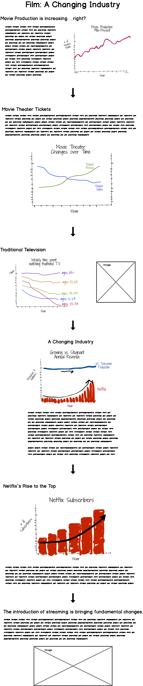

# Project Proposal II
This project is focusing on television and movies in the entertainment industry over the past several years, and how streaming platforms like Netflix are disrupting that established industry.  The new distribution platform is shifting viewers away from traditional television and movie theaters and towards streaming content on personal devices.

## Storyboarding and Wireframing
 

## User Research Protocol
**Target Audience:** Higher-ups at bigger production companies.  
**Approach to identifying representative individuals:**  As I will do not have access to interview my target audience, I aim to reach a small group of individuals with diverse backgrounds to get a broad perspective.  My group of interviewees will include two Heinz students and one medical student at the University of Pittsburgh, two females and one male, and range from ages 23 through 37.

| Prompt | Feedback |
| ------ | -------- |
| *What do you think the purpose of this is?* | "Show a shift in the entertainment world from attending movies to staying home and streaming." "Are you trying to answer the question: How is streaming (netflix) changing the film and tv landscape?" |
| *Who do you think this is for?* | "I think this is for anyone interested in marketing to consumers of entertainment, producers trying to figure out the best viewership for their next movie, or a streaming service wanting to know if they should break into the industry." |
| *What is confusing about this?* | "There is a header "Netflix rises to the top"... the graphs don't show anything about any other streaming service.  So then I thought - is this about Netflix specifically?  Or if this is about the industry at large, should the focus be on "streaming services rising to the top".  I didn't know if Netflix specifically was rising to the top of streaming services, Netflix was rising to the top of all other types of entertainment, or Netflix was a stand in word representing a new pattern in streaming." "There is a graph about people viewing "traditional tv" is declining, but then the next one shows tv viewing is stagnant..." |
| *What would you change?* | "Maybe another way to show the revenue one is some sort of bar chart.. showing the overall % of "tv viewing revenue, from traditional or streaming" is shifting and streaming is starting to make up a bigger piece of the pie?" "Would it be possible to make a visual that put Number of movie tickets sold with increases in "streaming".  I know their y-axis’s would be different, but looking at the time overlap.. and if there is any relation would be interesting." "Are you actually going to put that much text there? I feel like you got to the point fairly quickly with just graphs." |
| *What is your main takeaway?* | "If viewership is declining, but revenue is staying the same.. that means they are charging more for tv, and movies are charging more..." |

## Updated Wireframe

## Mood Board
 

## Data Sources
| Source | Data Description |
| ------ | ----------- |
| [Source](https://www.kaggle.com/danielgrijalvas/movies/version/2) | Contains 6820 movies (220 movies per year, 1986-2016) scraped from IMDb and contains information about each movie’s budget, production company, country of origin, director, genre, gross revenue, IMDb rating, and release date. |
| [Source](https://www.kaggle.com/clouds0715/thefilmindustry#the%20film%20industry_US_08-17_English.csv) | Originally from [The Numbers](https://www.the-numbers.com/market/), a data and movie website, and contains data on number of screens, average ticket price, total gross, the number of sold tickets and the number of movies released in United States. |
| [Source](https://www.statista.com/statistics/786371/time-spent-traditional-tv-age/) | Originally published by [MarketingCharts](https://www.marketingcharts.com/featured-105414) and contains a breakdown of time spent watching traditional TV by age. |
| [Source](https://www.statista.com/statistics/250937/quarterly-number-of-netflix-streaming-subscribers-in-the-us/) | Sourced from Netflix and contains data on streaming subscribers from 2011 to 2019. |
| [Source](https://www.statista.com/statistics/272545/annual-revenue-of-netflix/) | Contains annual revenue from Netflix from 2002 to 2019. |
| [Source](https://www.statista.com/statistics/293450/revenue-of-television-production-in-the-us/) | Contains annual revenue of television production in the United States from 2009 to 2018. |

