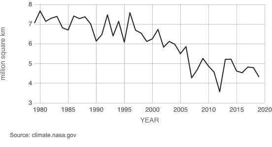

# Data Vizualization Homework 3
February 2, 2020

### Original Data Visualization

Source [here:](https://climate.nasa.gov/vital-signs/arctic-sea-ice/) "Arctic Sea Ice Minimum: Average September Extent" from NASA.gov

### My Process
I chose to wireframe my process using pen and paper.  It was more of an iterative process than I originally imagined.  My original graph had a less prominate (pale gray) average line and I ended up with a lot of feedback about what the colors meant before noting that blue was above the average line and red was below.  I ended up with a much more prominent line with just the average number written, as the people that I asked could intuitively tell that it was the average.  When you hover over the line, the tooltip does state that it is the average in case it is not clear to everyone.  I also went through a few iterations of color where I originally had green as good and red as bad, but had someone point out that it was a "grassy" green and seemed not quite right.  I then shifted to blue to allude to the wintry sea ice.  My final comments were about the title, and making it clear that the graph was showing the average area of sea ice over the month of september for each year.  It was eye-opening to realize how challenging it was to "unsee" that data, and that because I was working with the actual data, others had a much better sense of what did and didn't make sense to a new audience.

## Final Visualization
<iframe src="https://public.tableau.com/views/ArcticSeaIceExtent_15806938269010/Dashboard1?:showVizHome=no&:embed=true" width="100%" height="500"></iframe>
